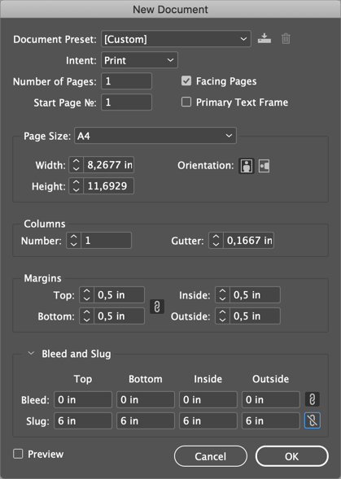
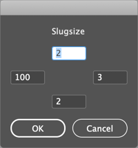

# Setting the Size of the slug to large values

The "New Document" dialog has a max-value of 6 inches for the slug. I do not know why.

You *can* set very large slug (100 inches and more) when setting `document.documentPreferences.slugTopOffset` et.al

This is the single task of this script.

The dialog is a simple but nice ScriptUI implementation, in case you are interested.